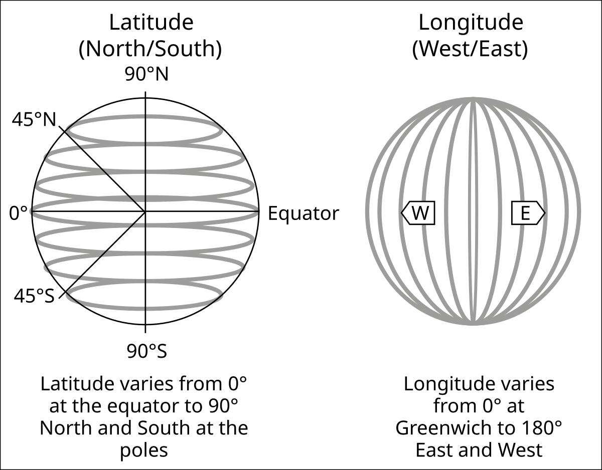
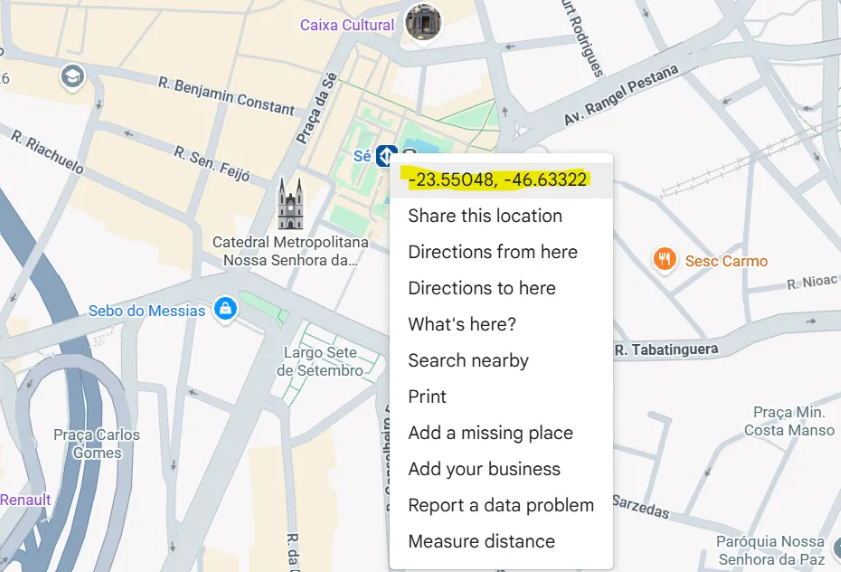
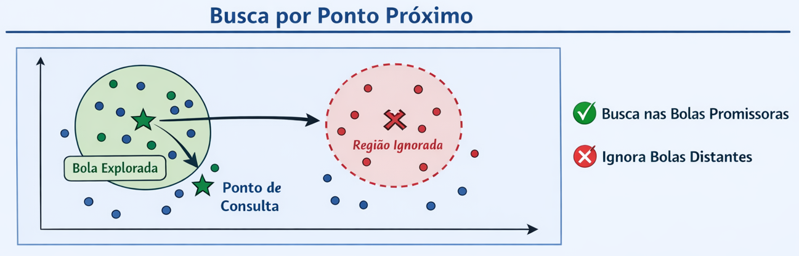
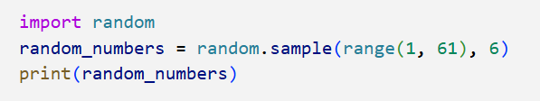

# O algoritmo Balltree

Digamos que eu seja uma transportadora, e para 10.000 endereços de entrega, quero saber qual dos 50 centros de distribuição é o mais próximo?

Como fazer grandes buscas cartográficas de forma eficiente?

A forma mais simples possível é calcular as distâncias (por exemplo, euclidiana) de todas entregas para todos os CDs. Daria 500.000 operações de cálculo.

Porém, há uma forma melhor, e é dada pelo algoritmo Balltree.

A ideia é utilizar a estrutura intrínseca das coordenadas para facilitar a busca.

Considere que a Terra é modelada por uma esfera perfeita (o que não é totalmente verdade), e que as latitudes e longitudes são os ângulos formados a partir do centro da esfera. As latitudes vão de 0 (linha do Equador) a +-90 graus (polos norte e sul). As longitudes vão de 0 (meridiano de Greenwich) a +-180 graus.
Latitude e Longitude (desenho da Wikipedia)


Exemplo, o centro de São Paulo é dado por: 
(-23.5504, -46.6332)



Há uma estrutura na informação de latitude e longitude. Por exemplo, um ponto com latitude (+40.2, +30.9) vai ser naturalmente muito mais distante do centro de SP do que outro com latitude (-23.8, -47.9), porque as diferenças de coordenadas são menores.

Então, porque não utilizar essa característica a nosso favor? É exatamente o que o algoritmo Balltree faz. 

Conforme o próprio nome dá uma dica, é uma árvore de buscas sobre bolas, regiões, para filtrar somente a vizinhança próxima e ignorar os pontos menos promissores.

O chatGPT construiu uma figura assim para explicar o algoritmo.


A complexidade de construção da árvore é da ordem n*log(n), e a de busca, log(n).

Portanto, para o mesmo caso de 10.000 endereços, para construir a árvore seriam necessárias 10 mil*log(10 mil) = 40 mil operações, e para buscar, 50*log(10000) = 200 operações apenas. Ou seja, muitíssimo mais efetivo do que as 500 mil operações do caso força bruta.

(Ou você pode fazer o inverso, construir a árvore com os 50 CDs e buscar nos 10 mil endereços)

Uma analogia é criar um índice em uma coluna no SQL. Vai demandar um custo de processamento de criar o índice, mas a consulta será muito mais rápida.

A analogia com index SQL vale também para quando NÃO usar o balltree. Se os dados mudam toda hora e tiver que recriar o índice, não vale a pena. Se forem poucas consultas e fazer na força bruta for suficiente, idem.

Outra nota, num plano, o equivalente à distância euclidiana é a distância haversine. É o mesmo conceito, mas numa esfera. Ou seja, calcula-se a diferença entre ângulos e o raio da Terra para termos o arco sobre a esfera entre dois pontos.

Vejamos um exemplo de uso. Disponibilizei o código completo no Github: asgunzi/exemplo_balltree: Exemplo do uso do algoritmo Balltree para Python

Este bloco criar 10 mil pares de coordenadas aleatórias. 
```[Python]
import numpy as np
from sklearn.neighbors import BallTree
import time

np.random.seed(42)

n_samples = 10_000

# Random locations on Earth
latitudes = np.random.uniform(-90, 90, n_samples)
longitudes = np.random.uniform(-180, 180, n_samples)

# Stack into (lat, lon)
entregas_deg = np.column_stack([latitudes, longitudes])

#BallTree with haversine requires radians.
entregas_rad = np.radians(entregas_deg)
```

A seguir, importa o Balltree, e cria os índices. Note que o balltree é criado na base a ser buscada, no caso, a de entregas.

```
from sklearn.neighbors import BallTree

tree = BallTree(entregas_rad, metric='haversine', leaf_size=40)
```

Criando as coordenadas dos CDs:
```
n_cds = 50

# Random locations on Earth
lat_cds = np.random.uniform(-90, 90, n_cds)
long_cds = np.random.uniform(-180, 180, n_cds)

# Stack into (lat, lon)
coord_cds = np.column_stack([lat_cds, long_cds])
```

Afinal, rodar o algoritmo. Note que o input do tree.query são coordenadas dos CDs. Para cada CD vai fazer a query na árvore de entregas e encontrar o endereço de entrega mais próximo.
```
k = 1 # Number of nearest neighbors to find

start = time.time()
dist_bt, ind_bt = tree.query(coord_cds, k=k)
balltree_query_time = time.time() - start

print(f"Ball Tree query time: {balltree_query_time:.4f} s")
```

Fazendo o mesmo em força bruta para comparar, deu:

- Balltree: 0.0025 s
- Força Bruta: 0.0338

Ou seja, o Balltree ganha facilmente.

Outro exemplo. Quero pegar os 5 pontos de entrega mais próximos de SP. Note que k = 5 na query.

```
query_sp_deg = np.array([[-23.5505, -46.6333]])
query_sp_rad = np.radians(query_sp_deg)

dist_sp_rad, ind_sp = tree.query(query_sp_rad, k=5)
dist_sp_km = dist_sp_rad[0] * EARTH_RADIUS_KM
neighbors = entregas_deg[ind_sp[0]]

print("\nNearest neighbors to São Paulo:")
for i, (pt, d) in enumerate(zip(neighbors, dist_sp_km), 1):
    print(f"{i}: lat={pt[0]:.4f}, lon={pt[1]:.4f}, dist={d:.2f} km")
```


Resultando em:




Notebook completo:
[https://github.com/asgunzi/exemplo_balltree/blob/main/exemplo_balltree.ipynb](https://github.com/asgunzi/exemplo_balltree/blob/main/exemplo_balltree.ipynb)


